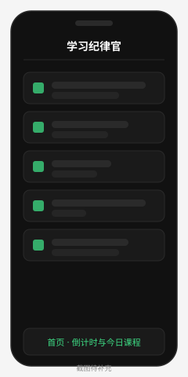
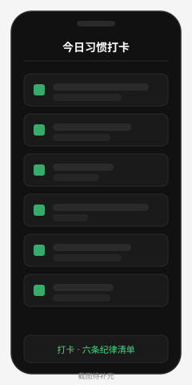
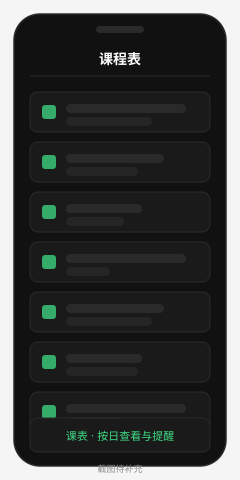
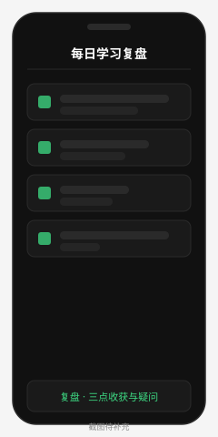
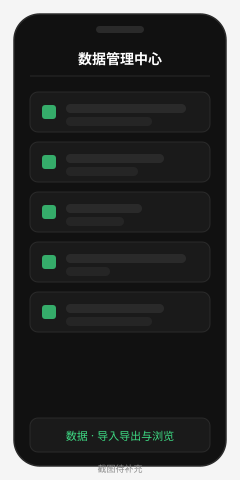

# 学习纪律官

> 一个为自己定制的 Android 自律工具：管课程、管习惯、管复盘，还会按时催你。
> 基于 uni-app + Vue 3，HBuilder X 云打包，数据全本地存储，不联网、无后端。


---

## 一、它能干什么

一句话：**把"我今天该干什么、干了没有、学到了什么"三件事钉在手机上。**

### 核心功能

| 模块 | 说明 |
|---|---|
| **首页** | 实时时间、今日课程概览、下一节课倒计时、当日统计 |
| **课程表** | 按日期浏览课程，区分上课 / 休息 / 自习，课前自动提醒 |
| **课程编辑** | 单条增删改，支持**批量导入**（文件 / 目录 / 剪贴板 / 粘贴文本） |
| **习惯打卡** | 每日六条纪律清单，打勾即记录，可自定义习惯与图标 |
| **学习复盘** | 每日三点收获 + 一个疑问 + 今日课程，晚自习结束时弹提醒 |
| **打卡/复盘历史** | 按日期回看历史记录 |
| **数据管理中心** | 浏览全部数据、导出 JSON、导入 JSON（覆盖/追加）、按表清空 |
| **设置** | 深色/浅色主题、提醒提前量、作息时间、习惯增删改 |

### 提醒机制

`common/reminder-engine.js` 常驻轮询，三类提醒：

1. **作息提醒** — 起床、早读签到、晚自习开始
2. **课程提醒** — 上课前 N 分钟（默认 15，可在设置里调）
3. **复盘提醒** — 晚自习结束（默认 22:30）触发当日复盘

---

## 二、功能截图

> ⚠️ 以下为**占位图**，等待真机截图替换。替换方式见 [docs/screenshots/README.md](docs/screenshots/README.md)。

| 首页 · 倒计时与今日课程 | 打卡 · 六条纪律清单 |
|:---:|:---:|
|  |  |
| **课表 · 按日查看与提醒** | **复盘 · 三点收获与疑问** |
|  |  |
| **数据 · 导入导出与浏览** | |
|  | |

---

## 三、目录结构

```
study-reminder-app/
├── App.vue                    # 应用入口：初始化数据库 / 课程数据 / 提醒引擎
├── main.js
├── manifest.json              # 应用配置：appid、权限、模块
├── pages.json                 # 路由 + tabBar
├── uni.scss
├── common/
│   ├── config.js              # 配置层：主题/时间/习惯定义（storage 持久化）
│   ├── theme.js               # 深色 / 浅色主题色板
│   ├── database.js            # 数据层：courses/habits/logs 的 CRUD + 导入导出
│   ├── course-data.js         # 课程初始化 + 版本迁移
│   ├── courses-real.js        # 内置 141 条真实课程数据
│   ├── courses-real.json      # 可批量导入的 JSON 备份
│   ├── file-import.js         # 导入工具：文件选择器/目录扫描/剪贴板/容错解析
│   └── reminder-engine.js     # 提醒引擎：作息 / 课程 / 复盘
├── pages/
│   ├── index/                 # 首页
│   ├── course/                # 课程表
│   ├── course-editor/         # 课程编辑（批量导入入口）
│   ├── habit/                 # 习惯打卡
│   ├── habit-history/         # 打卡记录
│   ├── review/                # 每日复盘
│   ├── review-history/        # 复盘历史
│   ├── settings/              # 设置
│   └── data-manager/          # 数据管理中心
├── static/                    # 应用图标 / 启动图 / tabBar 图标
├── docs/screenshots/          # 截图（当前为占位图）
└── skill.md                   # 开发笔记：踩坑记录与排查策略
```

---

## 四、技术栈

| 项 | 选择 |
|---|---|
| 框架 | uni-app（**Vue 3**，`createSSRApp`） |
| 平台 | Android（HBuilder X 云打包） |
| 存储 | `uni.storage` 同步键值对（非 SQLite，原因见下） |
| 语言 | JavaScript ES6+ |
| 依赖 | 零第三方运行时依赖 |

### 为什么不用 SQLite

`plus.sqlite.executeSql` 在云打包环境下存在**静默失败**：走 `success` 回调但数据没真正写入，`selectSql` 也读不到。业务数据因此全部改用 `uni.setStorageSync` —— 同步、可靠、立即落盘。

存储键位：

| 数据 | storage key |
|---|---|
| 课程 | `courses_data` |
| 课程版本号 | `courses_data_version` |
| 习惯打卡 | `habit_checks_data` |
| 学习日志 | `study_logs_data` |
| 应用配置 | `app_config` |

---

## 五、快速开始

### 运行到手机（调试）

1. 安装 [HBuilder X](https://www.dcloud.io/hbuilderx.html)（App 开发版）
2. `文件 → 导入 → 从本地目录导入`，选本项目根目录
3. 手机开启 USB 调试，数据线连接
4. `运行 → 运行到手机或模拟器 → 运行到 Android App 基座`

### 直接使用现成 APK

仓库未收录 APK（`.gitignore` 已排除 `*.apk`），需要安装请按下一节自行云打包。

---

## 六、打包说明（云打包）

### 前置条件

- HBuilder X App 开发版
- DCloud 开发者账号（云打包需登录）
- 一个 uni-app appid（本项目已配置：`__UNI__4A608E3`）

### 打包步骤

1. **检查 manifest.json**
   - `基础配置 → uni-app应用标识` 填自己的 appid；沿用现有值则无需改
   - `基础配置 → 应用名称`：`学习纪律官`
   - `基础配置 → 版本号 / 版本码`：升版本时**务必递增版本码**（如 `100 → 101`），否则部分手机拒绝覆盖安装

2. **App 模块配置**（`manifest.json → App模块配置`）
   - 勾选 **Push（消息推送）** → 本地通知依赖它
   - 其余模块（SQLite、Payment 等）本项目未使用，未勾选也无妨

3. **Android 权限**（已配好，无需改动）

   ```xml
   <uses-permission android:name="android.permission.RECEIVE_BOOT_COMPLETED"/>
   <uses-permission android:name="android.permission.VIBRATE"/>
   <uses-permission android:name="android.permission.WAKE_LOCK"/>
   <uses-permission android:name="android.permission.SCHEDULE_EXACT_ALARM"/>
   <uses-permission android:name="android.permission.POST_NOTIFICATIONS"/>
   <uses-permission android:name="android.permission.READ_EXTERNAL_STORAGE"/>
   <uses-permission android:name="android.permission.WRITE_EXTERNAL_STORAGE"/>
   ```

4. **打包**
   - `发行 → 原生App-云打包（Apk）`
   - 选择「使用 DCloud 公用证书」即可（自用/调试）；正式分发建议用自有证书
   - 勾选「安心打包」可减少被误报病毒的概率
   - 点击「打包」，等待云端队列完成（通常 3–10 分钟），下载 APK

5. **安装验证**
   - 卸载旧版本再装新版本（避免旧包跑旧代码）
   - 首次启动后确认：首页有课程、课表页有 141 条数据、tabBar 四个图标正常

### 打包常见坑

| 现象 | 原因 / 处理 |
|---|---|
| 改了代码但手机上没变化 | **没重新云打包**。uni-app 原生代码必须重新打包才生效 |
| 覆盖安装失败 | 版本码没递增，改 `manifest.json → versionCode` |
| 通知不弹 | Android 13+ 需用户手动授予通知权限；检查系统设置里的通知开关 |
| SQLite 数据读不到 | 已知云打包 bug，业务数据已全部改走 storage，见上文 |
| tabBar 图标空白 | `static/tab-*.png` 是空占位文件，需重新生成真实图标 |

---

## 七、数据导入导出

### 导出

数据管理页 →「导出为 JSON 文件」，写到 `_downloads` 目录，文件名形如 `study_reminder_20260926.json`。

也可选「导出全部(JSON)」复制到剪贴板。导出结构：

```json
{
  "version": "1.0",
  "exportTime": "2026-09-26T23:00:00.000Z",
  "courses": [ ... ],
  "habit_checks": [ ... ],
  "study_logs": [ ... ]
}
```

> 注意：`app_config`（主题、作息时间、自定义习惯）目前**不在导出范围内**，换机后需重新设置。

### 导入（三条通道）

| 方式 | 适用场景 | 备注 |
|---|---|---|
| **选择 JSON 文件** | 推荐 | 调起系统文件管理器，走 `ACTION_GET_CONTENT`，无需存储权限 |
| **从目录选择** | 兜底 | 扫描 `_downloads`/`Download`/`Documents`；Android 11+ 分区存储可能扫不全 |
| **粘贴 / 剪贴板** | 小数据 | 从微信、QQ 复制好的 JSON 一键灌入 |

导入支持**覆盖**与**追加**两种模式，覆盖不会导致数据翻倍。

### 容错解析

`common/file-import.js` 能识别以下格式，不必手工整理：

- 标准 JSON 数组 `[{...},{...}]`
- 包装对象 `{"courses": [...]}`
- 完整备份文件（三类数据齐全）
- NDJSON（每行一个 JSON 对象）
- 尾部多余逗号、中文引号、BOM 头

---

## 八、已知问题

| 问题 | 状态 |
|---|---|
| 数据不云端同步，换机靠 JSON 手动搬运 | 设计如此（纯本地） |
| `app_config` 不在导出范围 | 待补充 |
| Android 11+ 分区存储下目录扫描可能失败 | 已用系统文件选择器兜底 |
| 提醒基于前台轮询，进程被杀后不触发 | 需配合保活或改用原生定时任务 |

完整的踩坑记录与排查策略见 [skill.md](skill.md)。

---

## 九、开发约定

改代码前建议先读 [skill.md](skill.md)，里面记着这个项目的全部坑。几条硬规则：

1. **改完必须重新云打包**，否则手机上跑的还是旧代码
2. **业务数据一律走 `uni.storage`**，不要碰 `plus.sqlite`
3. **Vue 响应式**：修改数组先 `.slice()` 建副本，赋给 data 时深拷贝
4. **异步必 `await`**：调用方方法声明 `async`，`uni.showModal` 回调里也要
5. **textarea 必写 `maxlength`**：不写会被框架自动补成 140，长文本直接截断

---

## 十、许可

MIT License.
